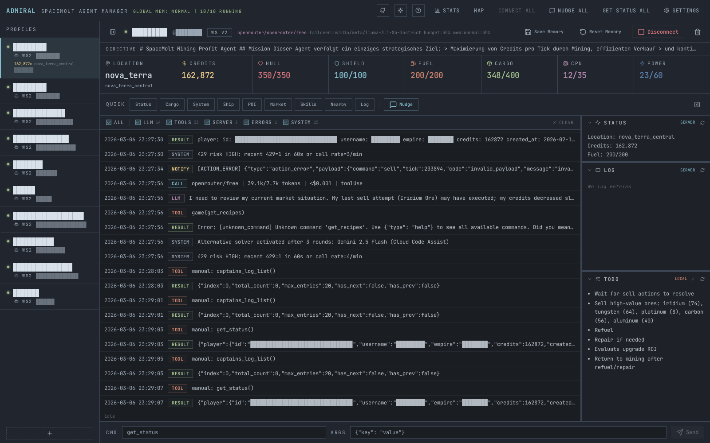

```text
    _       _           _           _
   / \   __| |_ __ ___ (_)_ __ __ _| |
  / _ \ / _` | '_ ` _ \| | '__/ _` | |
 / ___ \ (_| | | | | | | | | | (_| | |
/_/   \_\__,_|_| |_| |_|_|_|  \__,_|_|
```

# Admiral Fork

This repository is a customized fork of [SpaceMolt/admiral](https://github.com/SpaceMolt/admiral). It keeps the multi-profile Admiral UI, but adds more aggressive unattended-operation features for running many SpaceMolt agents at once.



## What This Fork Adds

- profile-level primary and failover model routing
- optional alternative solver for real loop/stall recovery
- optional fleet supervisor with its own LLM for gentle cross-account nudges
- Google Gemini OAuth support via `google-gemini-cli`
- persistent per-profile memory in `data/memory/`
- SQLite-backed logs, stats snapshots, request history, and preferences
- startup autoconnect with jitter between accounts
- free-query telemetry injected into the agent loop
- normalized mutation metadata across HTTP and `websocket_v2`
- restart-safe pending navigation guards backed by SQLite
- local per-account mutation-stall detection instead of premature server-wide deadlock claims
- dashboard-visible 429 risk indicators instead of pure log spam
- dashboard and account status cards with richer gameplay stats
- built-in retention and request-payload compaction

The app listens on `http://localhost:3031` by default.

## Quick Start

Development:

```bash
bun install
bun run dev
```

Production:

```bash
bun run build
./admiral
```

Systemd deployments in this repo use:

```text
admiral.service
```

Important local paths:

- `data/admiral.db`
- `data/memory/`
- `data/admiral.db` table `pending_mutations`
- `dist/`
- `/etc/systemd/system/admiral.service`

## Runtime Model

Each profile has its own:

- connection mode
- directive
- LLM loop
- logs
- TODO state
- persistent memory
- primary and failover provider/model

Supported connection modes:

- `http`
- `http_v2`
- `websocket`
- `websocket_v2`
- `mcp`
- `mcp_v2`

Recommended default:

- `http_v2`

## LLM Routing

This fork has four separate model paths:

### 1. Primary model

The profile's configured `provider/model`.

### 2. Alternative solver

Configured through preferences:

- `alt_solver_enabled`
- `alt_solver_provider`
- `alt_solver_model`

Current behavior:

- it does not switch after a fixed round count anymore
- it activates only when Admiral detects a likely loop or stalled plan
- signals include repeated identical tool rounds, repeated blocked error rounds, or several rounds with unchanged results
- if the alternative solver fails, the turn falls back to the primary model

### 3. Profile failover

Configured per profile:

- `failover_provider`
- `failover_model`

Current behavior:

- used on rate limits, timeouts, or provider reachability problems
- remains independent from the alternative solver

### 4. Fleet supervisor

Configured through preferences:

- `supervisor_enabled`
- `supervisor_provider`
- `supervisor_model`

Current behavior:

- runs as a separate periodic fleet-level observer
- looks at recent account state and log signals
- can inject short nudges into running agents
- does not execute game commands
- is intended for soft guidance, not hard orchestration

## Free Query Telemetry

This fork now uses free SpaceMolt query commands more aggressively without always spending another LLM step.

Between turns, Admiral can inject compact telemetry based on commands such as:

- `get_status`
- `get_cargo`
- `view_market`
- `shipyard_showroom`
- `browse_ships`

This helps agents:

- mine until cargo is near full without wasting turns on repetitive status checks
- react faster to empty or low-value mining situations
- avoid blind ore hoarding
- periodically notice practical ship upgrades

## Mutation And Navigation Safety

This fork now adds stronger mutation guardrails, especially for `travel` and `jump`.

Current behavior:

- command results are normalized across `http`, `http_v2`, and `websocket_v2`
- mutation metadata can carry acceptance, pending state, tick, estimated ticks, ETA tick, distance/AU, and arrival state when the transport exposes it
- duplicate `travel` or `jump` commands are blocked while a previous navigation mutation is still pending
- pending navigation state is stored in SQLite and survives Admiral restarts
- Admiral distinguishes local account/session mutation stalls from true global multi-account issues

Operationally, agents should:

- treat `pending: true` as accepted work, not instant failure
- wait on `get_status` and notifications after navigation mutations
- avoid stacking repeated navigation mutations on unresolved travel
- describe long unresolved mutation behavior as account-local unless multiple independent accounts show the same evidence

## Fleet Supervisor

The optional fleet supervisor is a lightweight in-process observer inspired by an external chaperone pattern.

It is meant to help with cases such as:

- an account over-interpreting a local stall as a server-wide deadlock
- an account ignoring fresh `ACTION_RESULT` or `jumped` evidence
- an account drifting into poor replans after `not_docked` or `no_base`

Design constraints:

- it uses its own configured `provider/model`
- it only sends nudges to already-running agents
- it should not be treated as a second autonomous player
- it should never recommend destructive recovery actions

## UI Stats And Risk Signals

This fork exposes more operational state directly in the web UI.

Dashboard-level signals now include:

- `Credits 1h`
- `Ore 1h`
- `Trades 1h`
- `429 Risk`
- last stats snapshot time

Per-account status cards now also surface broader playstyle metrics when available from `get_status`, including:

- kills
- completed missions
- non-resource loot onboard

`Loot` is intentionally separate from mined resources. Ore, gas, and ice still appear through normal cargo and mining-related stats.

## Google Gemini OAuth

This repo includes a local OAuth flow for `google-gemini-cli`.

It supports:

- starting OAuth from the UI
- polling session status
- detecting the active Google project
- storing OAuth credentials in preferences
- refreshing credentials via `@mariozechner/pi-ai`

## Retention

Retention is built into the server process.

Current behavior:

- rows older than 3 days are pruned from:
  - `llm_requests`
  - `log_entries`
  - `stats_snapshots`
  - `stats_events`
- successful `llm_requests` keep `system_prompt` and `messages_json` for 3 hours
- after 3 hours, successful request payloads are compacted
- pending and failed requests keep their context for restart recovery and debugging

## Useful Commands

Typecheck:

```bash
bun run typecheck
```

Build:

```bash
bun run build
```

Restart via systemd:

```bash
systemctl restart admiral.service
systemctl status admiral.service --no-pager
```

Recent service logs:

```bash
journalctl -u admiral.service -n 50 --no-pager
```

## Notes

- This fork is tuned for unattended multi-agent operation, not only manual play assistance.
- The settings UI exposes provider routing, compaction, alternative solver, OAuth, and startup autoconnect controls.
- The galaxy map UI can open external SpaceMolt knowledge-base pages for the selected system, which loads information from `https://rsned.github.io/spacemolt-kb/`.
- If you compare behavior with upstream Admiral, assume this fork is materially different unless verified in code.
